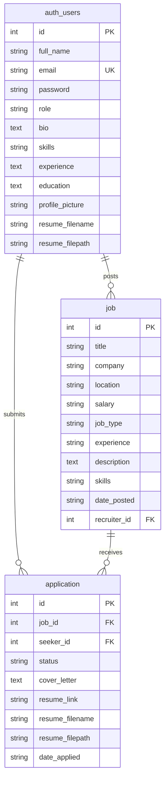

# Online Job Portal System - Database Schema Documentation

This document describes the database schema, normalized tables, relationships, constraints, and performance indexes configured in the system.

The application uses **SQLAlchemy ORM** and is compatible with **SQLite**, **PostgreSQL**, and **MySQL** backends.

---

## Database Schema Diagram (Mermaid)

---

## 1. Table: `auth_users`
Stores user credential profiles, designated role (seeker vs. recruiter), bio, uploaded file paths, and metadata.

| Column Name | Data Type | Constraints | Description |
| :--- | :--- | :--- | :--- |
| `id` | `Integer` | `Primary Key`, `Auto Increment` | Unique user identifier. |
| `full_name` | `String(50)` | `Nullable = False` | Full name of the user. |
| `email` | `String(100)` | `Nullable = False`, `Unique = True` | Email address (login identifier). |
| `password` | `String(100)` | `Nullable = False` | Securely hashed password. |
| `role` | `String(50)` | `Nullable = False` | Account role: `seeker` or `recruiter`. |
| `bio` | `Text` | `Nullable = True` | Profile introduction/summary. |
| `skills` | `String(250)` | `Nullable = True` | Comma-separated list of professional skills. |
| `experience` | `Text` | `Nullable = True` | Previous career roles (Seekers only). |
| `education` | `Text` | `Nullable = True` | Education details (Seekers only). |
| `profile_picture` | `String(250)` | `Nullable = True` | Uploaded avatar image filename. |
| `resume_filename` | `String(250)` | `Nullable = True` | Original uploaded resume filename. |
| `resume_filepath` | `String(250)` | `Nullable = True` | Server file path of default profile resume. |

* **Index**:
  - `idx_user_email` on column `email` (supports fast login lookups).

---

## 2. Table: `job`
Stores details of posted vacancies. Created by recruiters.

| Column Name | Data Type | Constraints | Description |
| :--- | :--- | :--- | :--- |
| `id` | `Integer` | `Primary Key`, `Auto Increment` | Unique job identifier. |
| `title` | `String(100)` | `Nullable = False` | Job title (e.g. "Python Developer"). |
| `company` | `String(100)` | `Nullable = False` | Company hiring for the role. |
| `location` | `String(100)` | `Nullable = False` | Geographic location (e.g. "Remote"). |
| `salary` | `String(50)` | `Nullable = False` | Salary range (e.g. "$120k - $145k"). |
| `job_type` | `String(50)` | `Nullable = False` | Type: `Full Time`, `Part Time`, `Contract`, `Internship`. |
| `experience` | `String(50)` | `Nullable = False` | Experience requirements (e.g. "3+ Years"). |
| `description` | `Text` | `Nullable = False` | In-depth description of responsibilities. |
| `skills` | `String(200)` | `Nullable = False` | Comma-separated required skills. |
| `date_posted` | `String(50)` | `Nullable = True` | Formatted posting date. |
| `recruiter_id` | `Integer` | `Foreign Key` -> `auth_users.id`, `ON DELETE CASCADE` | Link to the posting recruiter. |

* **Index**:
  - `idx_job_recruiter` on column `recruiter_id` (accelerates listing recruiter's own jobs).
* **Cascades**:
  - Deleting a recruiter deletes their associated job postings.

---

## 3. Table: `application`
Links applicants (seekers) to job listings. Implements duplicate checks.

| Column Name | Data Type | Constraints | Description |
| :--- | :--- | :--- | :--- |
| `id` | `Integer` | `Primary Key`, `Auto Increment` | Unique application identifier. |
| `job_id` | `Integer` | `Foreign Key` -> `job.id`, `ON DELETE CASCADE` | Job being applied to. |
| `seeker_id` | `Integer` | `Foreign Key` -> `auth_users.id`, `ON DELETE CASCADE` | Applying candidate. |
| `status` | `String(50)` | `Nullable = False`, `Default = 'Pending'` | Pipeline status: `Pending`, `Reviewed`, `Interviewing`, `Offered`, `Rejected`. |
| `cover_letter` | `Text` | `Nullable = True` | Message explaining fit. |
| `resume_link` | `String(250)` | `Nullable = True` | Optional cloud URL to resume. |
| `resume_filename` | `String(250)` | `Nullable = True` | Filename of uploaded resume. |
| `resume_filepath` | `String(250)` | `Nullable = True` | Server file path of application resume. |
| `date_applied` | `String(50)` | `Nullable = True` | Timestamp date of application. |

* **Indexes**:
  - `idx_application_job` on column `job_id` (filters applications by job).
  - `idx_application_seeker` on column `seeker_id` (filters applications by applicant).
* **Cascades**:
  - Deleting a job or deleting a user automatically cascades to purge related applications, avoiding orphan entries.
